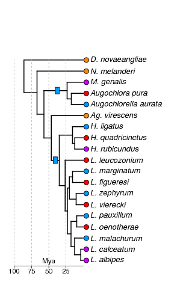

# Coding sequence analysis

Eusociality has evolved convergently within halictids two times. Subsequently, social behavior has been lost a large number of times. In our sampling, we have four instances of losses of social behavior in *Lasioglossum*, and one each in *Halictus* and the Augochlorines. These taxa are indicated in red. Ancestrally solitary taxa are in orange. Our sampling also includes four socially polymorphic species in purple.

The phylogeny file (`RAxML_bestTree.halictid_fourfold.tree`) is built from fourfold degenerate sites and is used across analyses.