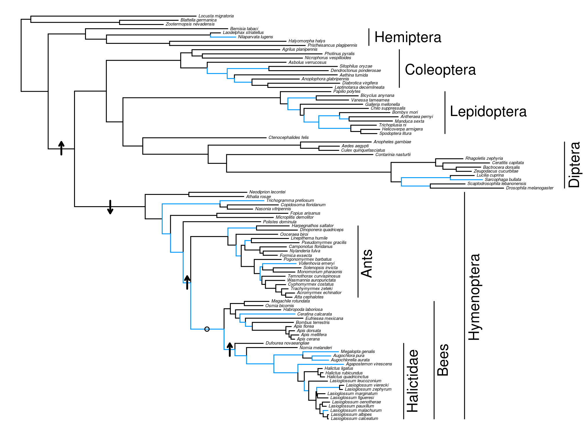

Blue branches are those detected with significant signatures of selection with HyPhy aBSREL. Arrows indicate the direction of significant rate shifts detected on particular branches. The only branch tested that did now show a significant rate shift is indicated by an "o". 

## AA rate shifts

I compiled apolpp from a bunch of taxa including Isoptera, Orthoptera, Hemiptera, Diptera, Lepidoptera, Coleoptera, and Hymenoptera. Combined with the halictid sequences, I used a total of 97 sequences in analyses.

Most basically, I looked for significant rate shifts in amino acid evolution using likelihood ratio tests with PAML. Basically, I said that either two sister clades could have different molecular clock rates or restricted them to having the same rates. The basic premise for this is discussed here: https://www.robertlanfear.com/publications/assets/Lanfear_Evolution_2010.pdf. (That paper actually claims that standard LRTs are overly sensitive and presents a permutation test that is better that we can apply if we want to further build confidence in these results.)

I performed a series of tests: 
 
#### Ants/bees vs. other Hymenoptera
2rate lnL = -210894.134887  
1rate lnL = -210916.084091  
LRT p = 3.46x10^(-11)  
branch rates are 1 (background), 0.86922 (Ants/bees), and 0.68511 (other Hymenoptera)  

#### Halictidae vs. other bees
2rate lnL = -210931.737432  
1rate lnL = -210941.317164  
LRT p = 1.20x10^(-5)  
branch rates are 1 (background), 1.25808 (halictids), and 1.04706 (other bees)  

#### Bees vs. ants
2rate lnL = -210930.703338  
1rate lnL = -210930.703674  
LRT p = 0.979  
branch rates are 1 (background), 1.23603 (bees), and 1.23470 (ants)  

#### Hymenoptera vs. other Holometabola
2rate lnL = -210781.139169  
1rate lnL = -210856.781487  
LRT p = 9.1x10^(-35)  
branch rates are 1(background), 1.12164 (Hymenoptera), and 1.63225 (other Holometabola  

#### Holometabola vs. Hemiptera
2rate lnL = -210843.764726  
1rate lnL = -210881.556954  
LRT p = 3.50x10^(-18)  
branch rates are 1 (background), 2.31459 (Holometabola), and 1.79724 (Hemiptera)  

#### Other bees (not Halictidae) vs. ants
2rate lnL = -210939.529512  
1rate lnL = -210945.136069  
LRT p = 0.000812  
branch rates are 1 (background), 0.91459 (other bees), 1.06880 (ants)  

My interpretation is that there was a significant rate increase in Holometabola as a whole. There was then another significant rate increase in Holometabola other than Hymenoptera. Perhaps there was also an increase in Hymenoptera but only slight compared to other Holometabola. Then there was another rate increase in Ants/bees relative to the more basal Hymenopterans. And, finally, though there was no increase in rate in bees overall, there was a significant rate increase in halictids. So apolpp had to change to make Ants/bees (the really social insects -- though potentially just drop in population size) and then again to do whatever is special about halictids. Perhaps their high social variability is related to the high rate of change of apolpp.

I also pulled out the apolpp pocket site predictions from Phyre2. When I perform a similar series of tests using just those AA sites (51 sites), only a single test shows a significant rate shift. This is the one between Ants/bees and other Hymenoptera (p = 0.0051). 

## AA evolution

Among the 51 sites within the binding pocket of apolpp (as determined by Phyre2), there are 10 for which the "derived" halictids (all except DNOV, NMEL, AVIR) all have the same amino acid which is different from the most common amino acid in non-Hymenopterans. Some of these are also present in bees and ants and wasps. So a Site like site 60 just represents the shared ancestry of Hymenoptera. Sites 33 and 41 looks more like something specific happening in halictids. Site 7 looks like something different in bees overall. `pocket_aas.txt` includes counts of amino acids in these 10 sites in the different clades. `otherbees` are non-halictid bees and `otherhymen` are wasps. `other` is non-hymenopterans. The site indices in this file are sites within the binding pocket, not in the sequence overall. The aligned pocket AAs are in `apolpp.muscle.pocket.afaa`.

## RELAX

Interestingly, HyPhy RELAX finds significant evidence of relaxed selection in both the Hymenoptera and the Ants/bees, though not halictids or bees as a whole. There is also significant evidence for Intensification of selection in Lepidoptera. I also tested Coleoptera but there was no significant signal. Not sure what, if anything, to make of this.

## Branch-site

Branch site tests of clades (halictids, Ants/bees, bees) were non-significant. This seems likely to just mean that particular sites weren't identifiable among all of the species in a clade. This seems reasonable, even with pervasive selection.

## aBSREL

aBSREL shows that there is a higher frequency of positive selection among halictid branches compared with other bees, ants, and hymenoptera. Lepidoptera is also pretty high, interestingly. Not that a single taxon can be included in multiple categories (e.g., halictids are included in "bee" and "hymenoptera"). This indicates that apolpp is changing particularly quickly in halictids, even compared with other Hymenoptera. Note that these numbers are based on FDR-corrected p-values < 0.1. The aBSREL results have different numbers because they use Bonferroni correction.

Clade|#Sig|#tested|Prop.
-----|----|-------|-----
otherholometabola|13.0|67|0.194
halictid|12.0|37|0.3243
otherbees|3.0|19|0.1579
hymenoptera|27.0|109|0.2477
hemiptera|1.0|9|0.1111
coleoptera|4.0|19|0.2105
bee|16.0|57|0.2807
ant|6.0|35|0.1714
lepidoptera|6.0|21|0.2857
diptera|3.0|23|0.1304

## dN/dS

If I just estimate dN/dS on different clades of insects using PAML, I get the results below. Note that I estimated the roots branches of several of the clades separately to see if that's where the major changes were occurring. Once again, halictids seem to be outliers -- faster dN/dS than all other clades. The ants are also relatively high compared to others.

Other: 0.00453  
Halictids: 0.1885  
Other bees: 0.1364  
Ants: 0.1731  
Other hymenoptera (wasps/sawflies): 0.07281  
Lepidoptera: 0.08868  
Coleoptera: 0.02139  
Diptera: 0.09567  
Hemiptera: 0.06203  
Root of bees: 0.10382  
Root of Ants/bees: 0.05684  
Root of Hymenoptera: 0.002161  
Root of Holometabola: 0.00103  

## Methods

Protein sequences were aligned with MUSCLE. The alignments were backtranslated using trimAl and filtered using the `automated1` method. A phylogeny was constructed from the aligned protein sequences using RAxML v7.3.0 with a PROTGAMMAWAG model of evolution. *Blatella germanica*, *Zootermopsis nevadensis* and *Locusta migratoria* were designated as the outgroup. The filtered aligned protein sequences were used for the analyses of rate shifts. The backtranslated aligned coding sequences were used for all tests for selection.

The way that I got sequences was that I BLASTed the HLIG version of the sequence. From the resulting hits, I downloaded the "hit table". I then went to the Entrez batch site (https://www.ncbi.nlm.nih.gov/sites/batchentrez) and uploaded the hit IDs (column 2 in the "hit table" file). From the result, you can "Send to:" "FASTA CDS". Also download the "summary" to get the taxonomy of each sequence.

## Pat1

I did some quick analyses of Pat1 as well. Interestingly, the results weren't very interesting. Here are the counts of branches identified as experiencing positive selection in a variety of clades:

Clade|#Sig|#tested|Prop.
-----|----|-------|-----
hemiptera|1.0|9|0.1111
halictid|3.0|37|0.0811
hymenoptera|4.0|123|0.0325
otherbee|1.0|21|0.0476
coleoptera|0.0|21|0.0
bee|4.0|59|0.0678
ant|0.0|37|0.0
lepidoptera|9.0|27|0.3333
diptera|0.0|15|0.0

This is very different than what I found for apolpp below. So Pat1 doesn't have the same kind of widespread rapid change that apolpp does.

## Hex110

I also began trying to explore Hex110 but quickly realized that it would be much more complicated. Since there are multiple types of similar hexamerin genes, it would be difficult to separate paralogs and homologs. This sort of analysis likely is not possible or would require substantial additional effort.
