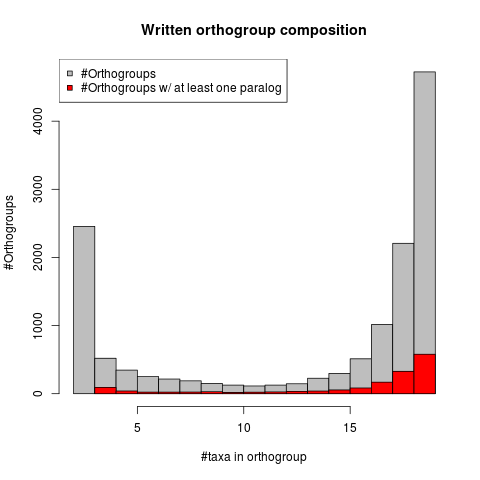

Filtering of orthologous groups identified by OrthoFinder proceeded in several steps.

1. Any sequence less than half the median length of all sequences in an orthogroup is removed.
2. Any species with more than three sequences in an orthogroup is completely removed.
3. Orthogroups with more than 1.5x the number of sequences as the number of species in an orthogroup is completely discarded.

These first three filters are accomplished at the first stage of analysis, when orthogroups resulting from OrthoFinder are first being written. The command used to do this is:

```python /Genomics/kocherlab/berubin/local/developing/selection_pipeline/selection_pipeline.py -b /Genomics/kocherlab/berubin/comparative/halictids/halictid_selection -o halictid -r /Genomics/kocherlab/berubin/comparative/halictids/orthology/orthofinder/protein_seqs/OrthoFinder/Results_Jan29_4/Orthogroups/Orthogroups.txt -t 2 -a write_orthos -d halictids.params```

The filtering parameters are currently hardcoded into ```remove_shorter_seqs()```. The result of this command is a directory ```halictid_orthos``` with fasta files of the CDS for every orthogroup and a directory ```halictid_orthos_prots``` with fasta files of the amino acid sequences for every orthogroup. An index file is also created ```halictid_ortho.index``` that lists the numbers of taxa and numbers of sequences present in each orthogroup. This file acts as a reference for future processing and choosing of orthogroups.

There are 13,716 resulting orthogroups. Note that even orthogroups with only two taxa (```-t 2```) were included at this stage for future potential use in mk tests. 4,144 of the resulting orthogroups have a single sequence from each of the 19 species. Here is the taxon composition of these orthogroups. In red are the number of orthogroups that include at least one paralog (or just multiple sequences from a single species):



Following this initial filter, orthogroups were aligned using FSA with the ```--nucprot``` option indicating coding sequence alignment. This aligning is accomplished by the command:

```python /Genomics/kocherlab/berubin/local/developing/selection_pipeline/selection_pipeline.py -b /Genomics/kocherlab/berubin/comparative/halictids/halictid_selection -o halictid -r /Genomics/kocherlab/berubin/comparative/halictids/orthology/orthofinder/protein_seqs/OrthoFinder/Results_Jan29_4/Orthogroups/Orthogroups.txt -p 16 -t 2 -a align_coding -d halictids.params```

In addition to creating alignments for each orthogroup, this command outputs a concatented alignment of all proteins with a single sequence per species per orthogroup. We created a rough species tree from this alignment using RAxML:

`raxmlHPC-PTHREADS-SSE3 -f a -x 12345 -p 12345 -# 100 -m PROTGAMMAWAG -s halictid.afa -n halictid.tree -T 20`

The resulting phylogeny recapitulates the previously inferred phylogenetic history for the group.

Post-alignment, a number of additional filters are applied:
1. Columns in the alignment with fewer than 6 sequences with known nucleotides (anything other than "-" and "N") are removed (this can be adjusted with ```--nogap_min_count```).
2. Columns in the alignment with less than 30% of sequences with known nucleotides (anything other than "-" and "N") are removed (this can be adjusted with ```--nogap_min_prop```).
3. Columns with sequences from fewer than 4 species are removed.

This is implemented in ```alignment_column_filtering()```.

Then we used the Jarvis et al. (Science 346: 1320-1331) Avian Phylogenomics Project scripts for filtering amino acid alignments, which mask over poorly aligning regions of individual sequences (rather than omitting entire alignment columns). The scripts ```spotProblematicSeqsModules.py``` and ```spotProblematicSeqsModules-W12S4.py``` were downloaded from ftp://parrot.genomics.cn/gigadb/pub/10.5524/101001_102000/101041/Scripts.tar.gz on 1/31/2019. These scripts were incorporated into the ```selection_pipeline.py``` pipeline through the ```jarvis_filtering()``` function.

The previous sequence of filtering on the columns of alignments was then performed again on the resulting masked alignments. Finally, individual sequences were filtered:
1. If the number of known nucleotides in a sequence after filtering was less than half the length of that sequence originally prefiltering.
2. If the sequence was more than 50% unknown (gap or masked) sequence.
3. Sequences with fewer than 300 known nucleotides in a sequence after filtering.

These filters are executed using the command:
```python /Genomics/kocherlab/berubin/local/developing/selection_pipeline/selection_pipeline.py -b /Genomics/kocherlab/berubin/comparative/halictids/halictid_selection -o halictid -r /Genomics/kocherlab/berubin/comparative/halictids/orthology/orthofinder/protein_seqs/OrthoFinder/Results_Jan29_4/Orthogroups/Orthogroups.txt -p 16 -t 4 -a alignment_filter -d halictids.params --nogap_min_count 6```

These filtered alignments form the basis of all analyses of protein-coding sequences. For alignment filtering, we don't bother with orthogroups with fewer than four sequences represented. MK tests don't use the filtered alignments anyway.

## Comparison with previous filters

Other procedures (e.g., Gblocks, trimAl) for filtering alignments are often employed in comparative genomics studies and we also explored these as potential options. We ran Gblocks (with `-t=c -b5=h`) and trimAl (`-automated1`) on all of the raw alignments produced by FSA. Below, we compare the resulting alignments from only those loci that included a single sequence from all 19 species included in the study.

`#vars` is the number of variable sites present in the alignments.

`#vars min 12` is the number of variable sites with data for at least 12 species.

`#all taxa` is the number of sites with data for all 19 taxa.

The rest of the rows are the numbers of nucleotides included for each species across all alignments.

Sites|Raw alignment|Gblocks filtered|trimAl filtered|First column filter|Jarvis filter|Second column filter|
-----|-------------|----------------|---------------|-------------------|-------------|--------------------|
#vars|3338594|2966466|3063615|3180417|3174396|3174385|
#vars min12|3093673|2963898|3028907|3093673|3087880|3087880|
#all taxa|6150441|6129976|6150419|6150441|6131654|6131654|
Dnov|8450813|7732315|7845549|8001458|7992618|7992597|
NMEL|8595305|8008431|8138567|8332588|8326316|8326313|
AAUR|8564660|7999721|8120554|8311111|8310118|8310115|
APUR|8684039|8086998|8224435|8428557|8426682|8426679|
Mgen|9001557|7893521|8023555|8194034|8191685|8191667|
AVIR|8433085|7874525|7977212|8164216|8160970|8160967|
HLIG|8611819|8065461|8206633|8423618|8422442|8422424|
HRUB|8606846|8047456|8179808|8400958|8400391|8400373|
HQUA|8493598|8028674|8146553|8345339|8344958|8344955|
LLEU|8669573|8049513|8231043|8455477|8453998|8453980|
LMAR|8617274|8089230|8253704|8475639|8475051|8475048|
LFIG|8545244|8048735|8195928|8413963|8413264|8413252|
LZEP|8610128|8025035|8167813|8370514|8369800|8369782|
LVIE|8561469|8072891|8215238|8415769|8415331|8415313|
LPAU|8486579|7941399|8099967|8307643|8306593|8306587|
LOEN|8548880|8006094|8166538|8387695|8385853|8385841|
LMAL|8645148|8061513|8237853|8467895|8467589|8467577|
LCAL|8635444|8096313|8256967|8484048|8483667|8483664|
LALB|8729372|8092200|8264874|8489013|8488515|8488512|


Comparing the Gblocks and trimAl columns with the last "Second column filter" column, representing the filter used for further analyses, we can see that our approach includes more variable sites in the final alignment (3,174,385 vs. 2,966,466 for Gblocks and 3,063,615 for trimAl), including when limited to only those sites with at least 12 taxa (3,087,880 vs. 2,963,898 for Gblocks and 3,028,907 for trimAl). Interestingly, although our filter includes more sites where all taxa are present (6,131,654) than Gblocks (6,129,976), this is actually fewer than result from the trimAl filter (6,150,419). The Jarvis filter is based on an analysis of the composition of windows and may sometimes filter out the conserved boundaries of otherwise poorly aligned windows more often than trimAl. Or our approach may more effectively filter poorly aligned but relatively complete sites. Regardless, given the greater amount of variable sequence and total sequence from each taxon included as a result of our filtering approach, we used this method for analyses moving forward.

Raw alignments are present in `halictid_fsa_coding.tar.gz` and filtered alignments after the final sequence filtering and removal of any paralogs are present in `halictid_fsa_coding_jarvis_columnfilt_seqfilt_noparas.tar.gz`. `halictid_filtered.index` lists the number of taxa and number of sequences present in each locus after filtering (but before paralog removal) as well as listing all sequences present in each locus.